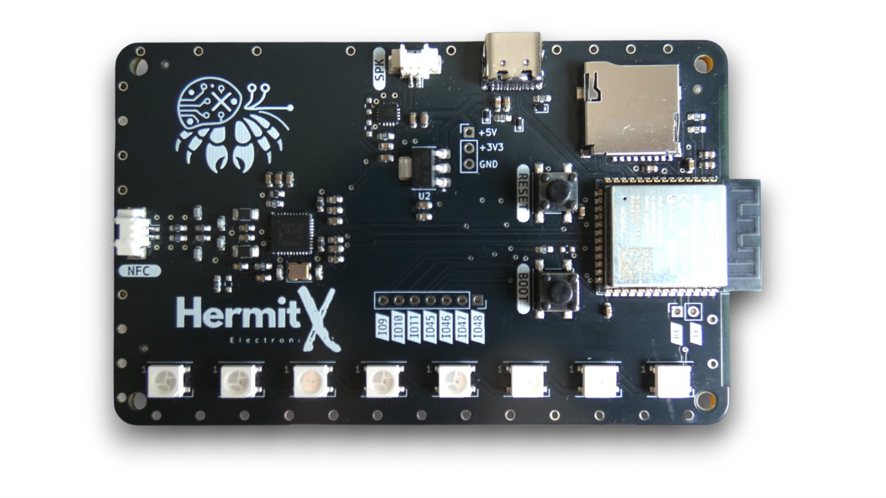
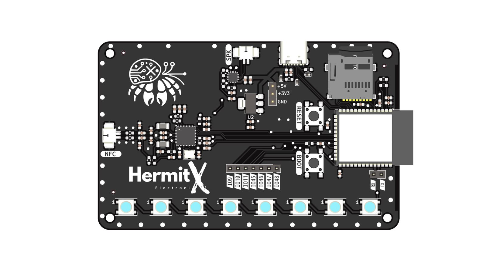
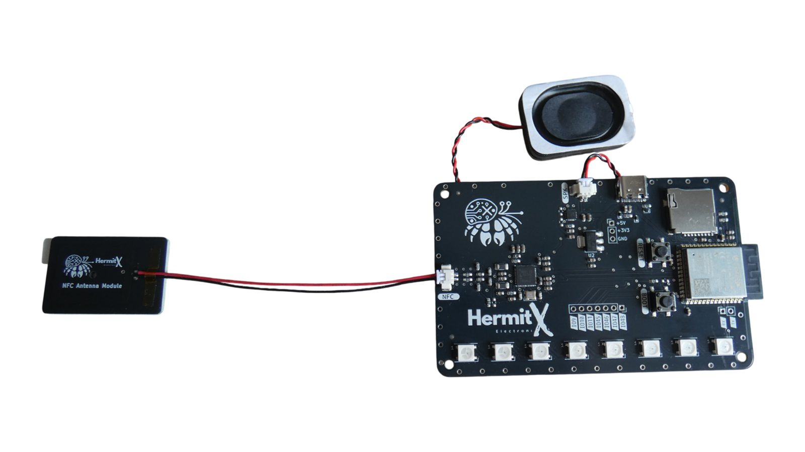
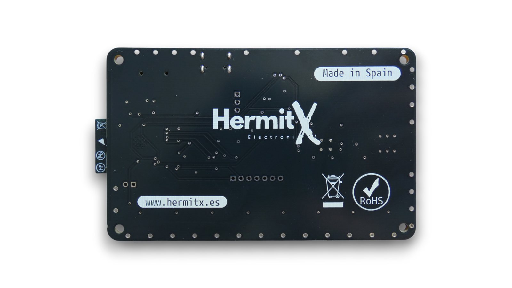
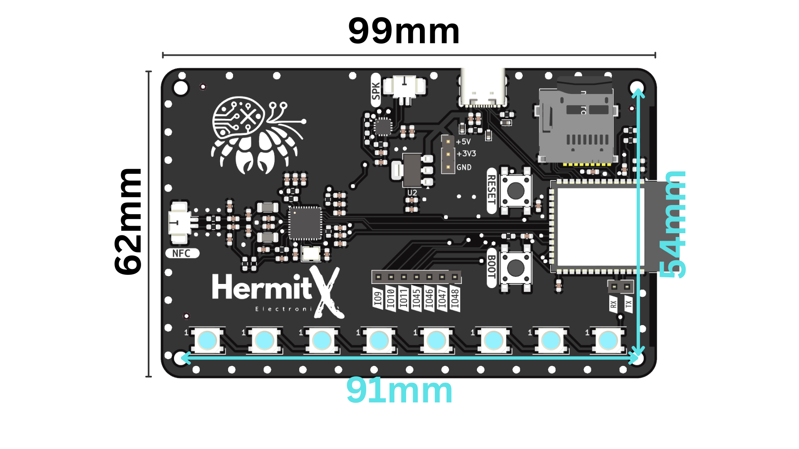
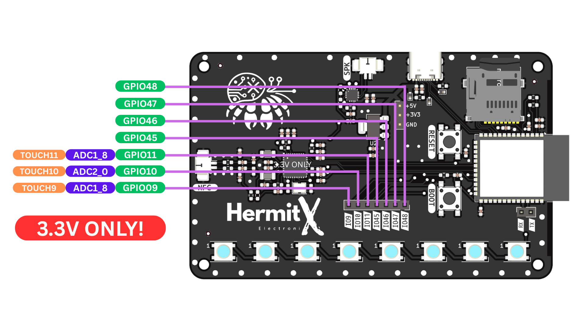
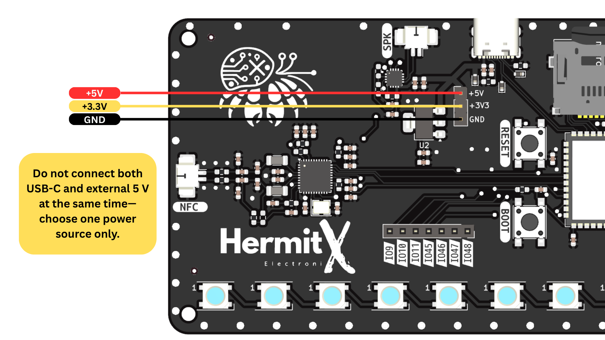

# NFC Card Reader Module

ESP32-S3 development module with **PN532 NFC reader**, **MAX98357 I²S amplifier**, **8× WS2812B addressable RGB LEDs** and a **microSD card slot** — for synchronized audio-visual interactions, NFC-triggered behaviors, and local storage of audio or data.

- **Product page:** https://learn.hermitx.es/product/CardReader
- **Buy:** https://lectronz.com/products/nfc-card-reader-module
- **Vendor:** [HermitX SLU](https://hermitx.es)



<p align="center">
  
  
  
</p>

---

## Package contents

- Main module PCB (ESP32-S3 + PN532 + MAX98357 + 8× WS2812B LEDs + microSD slot)
- External NFC antenna PCB with cable connector
- 3 W speaker
- NTAG215 NFC card

> **Not included:** microSD card and audio file. See [Quick start](#quick-start).

---

## Specifications

| Component | Description |
| --- | --- |
| **MCU**       | ESP32-S3 (Wi-Fi & BLE) |
| **NFC**       | PN532 — supports ISO/IEC 14443 A/B, P2P, emulation |
| **Amplifier** | MAX98357 (I²S → 3 W speaker) |
| **LEDs**      | 8× WS2812B addressable RGB LEDs |
| **SD slot**   | microSD (up to 32 GB) |
| **Power**     | USB-C *or* external 5 V on the `+5V` pin (not both) |

### NFC capabilities (PN532, 13.56 MHz)

- ISO/IEC 14443A/MIFARE reader/writer — MIFARE Classic 1K/4K, Ultralight, NTAG series, DESFire
- ISO/IEC 14443B reader/writer — Type B tags
- FeliCa reader/writer — Sony FeliCa
- ISO/IEC 14443A/MIFARE card emulation — emulate MIFARE Classic 1K/4K
- FeliCa card emulation
- ISO/IEC 18092 (ECMA-340) NFC peer-to-peer

---

## Pinout



### PN532 (SPI)

| Signal | GPIO |
| ------ | ---- |
| MISO   | IO12 |
| MOSI   | IO13 |
| SCK    | IO14 |
| SS     | IO15 |
| IRQ    | IO21 |

### MAX98357 (I²S)

| Signal | GPIO |
| ------ | ---- |
| DOUT   | IO40 |
| BCLK   | IO41 |
| LRC    | IO42 |

### microSD card (SPI)

| Signal | GPIO |
| ------ | ---- |
| MOSI   | IO17 |
| MISO   | IO8  |
| CLK    | IO18 |
| CS     | IO5  |

### WS2812B LEDs

| Signal | GPIO |
| ------ | ---- |
| Data   | IO16 |

### Available GPIOs

GPIO **9, 10, 11, 45, 46, 47, 48** are unused and exposed for your own use. **3.3 V logic only — do not apply higher voltages.**



### Power

- **External 5 V input (`+5V`)** — connect a regulated 5 V source here.
- **3.3 V regulator output (`+3V3`)** — output of the onboard regulator. Use to power external 3.3 V logic only.
- If you power the module via USB-C, the `+5V` pin is tied to USB bus voltage. **Do not connect USB-C and external 5 V at the same time.**



---

## Quick start

The module ships pre-flashed with the [`01-basic`](examples/01-basic) example. To get the audio playback working you only need a microSD card with one file:

1. Format a microSD card (≤ 32 GB) as **FAT32**.
2. Copy an audio file to the root named `success.mp3`.
3. Insert the SD card into the slot on the module.
4. Power the module via USB-C or 5 V on the `+5V` pin.
5. Tap the included NTAG215 card on the antenna.

**Default behavior:**

- Idle: blue *chase* effect on the 8 WS2812B LEDs.
- On tag detection: 2 s yellow ramp → green LEDs + plays `/success.mp3` from the SD card.
- After playback: returns to chase.

### Audio file format

`success.mp3` (or any file you play with [`ESP32-audioI2S`](https://github.com/schreibfaul1/ESP32-audioI2S)) can be MP3, WAV, FLAC, AAC, M4A or OGG. Recommended for best results: **MP3, 44.1 kHz, stereo or mono, ≤ 192 kbps**. Place files at the SD card root.

> **Note:** No `success.mp3` is shipped in this repo because we cannot redistribute third-party audio without a clear license. Use your own clip.

---

## Examples

| Folder | Description |
| ------ | ----------- |
| [`examples/01-basic`](examples/01-basic) | Single-file Arduino-style loop. Polls the PN532, drives LEDs and audio in `loop()`. Easiest to read and modify. |
| [`examples/02-freertos`](examples/02-freertos) | Same behavior split across **FreeRTOS tasks** (LED state, NFC polling, audio). Uses a separate SPI bus for the PN532 to avoid contention with the SD card. Better starting point for projects that also need Wi-Fi, MQTT, web servers, etc. |

Both examples are written for **PlatformIO** with the `espressif32` platform. Open the example folder in VS Code with the [PlatformIO IDE extension](https://platformio.org/install/ide?install=vscode) and click **Upload**.

The same source should work in the **Arduino IDE** if you install the matching libraries:

- [`Adafruit_PN532`](https://github.com/adafruit/Adafruit-PN532)
- [`FastLED`](https://github.com/FastLED/FastLED)
- [`ESP32-audioI2S`](https://github.com/schreibfaul1/ESP32-audioI2S)

Select board **ESP32S3 Dev Module** and partition scheme **Default 4MB with spiffs** (or larger if your flash is bigger).

---

## Project ideas

- **Interactive museum guide** — NFC tags next to exhibits trigger an audio narration and matching LED animations.
- **Smart business card** — embed in a digital business card; tap with a phone to play a jingle and cycle brand colors.
- **Access control** — authorized cards trigger a green sequence and unlock a relay/solenoid; unauthorized cards flash red and play an alert.
- **Educational coding kit** — NFC-triggered audio puzzles and LED quizzes, with new clues stored on the SD card.
- **Sound art installation** — wall tiles with tags that play ambient sounds and trigger synchronized LED patterns across multiple modules.

---

## Repository layout

```
.
├── examples/
│   ├── 01-basic/         # Arduino-style single-file example
│   └── 02-freertos/      # FreeRTOS multi-task example
├── LICENSE
└── README.md
```

---

## License

[MIT](LICENSE) — © 2026 Ivan Hermida / HermitX SLU.

The hardware design and product photographs on [hermitx.es](https://hermitx.es) and [Lectronz](https://lectronz.com/products/nfc-card-reader-module) are not covered by this license.

---

## Support

- Issues / questions: open an issue on this repository.
- Commercial inquiries: https://hermitx.es
